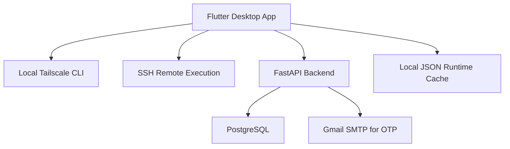

# ScaleServe

ScaleServe is a cross-platform desktop platform for managing Tailscale-connected machines, running remote SSH commands, and streaming local scripts into remote systems with centralized authentication, logs, and runtime sync.

[Watch the demo](https://www.youtube.com/watch?v=fp4zmaF7CgA)

## What It Does

ScaleServe brings network access, remote execution, and operator workflows into one interface. It combines a Flutter desktop app with a Python backend so you can discover devices on your tailnet, configure SSH access, execute commands remotely, and keep machine state and run history synced to PostgreSQL.

## Key Features

- Desktop control center for Tailscale status, peer discovery, and connection management
- Remote SSH command execution on selected tailnet devices
- Stream local files and scripts into remote Python, Bash, Node.js, PowerShell, Ruby, Perl, or custom stdin-based commands without permanent uploads
- Saved per-device SSH profiles with key-path and default-command support
- Built-in setup flows for SSH bootstrap, key generation, and onboarding commands
- Backend authentication with first-user bootstrap, JWT sessions, Gmail OTP MFA, and password reset
- PostgreSQL-backed storage for users, workspaces, machine inventory, remote profiles, command logs, and run history
- Local JSON runtime cache for resilience when backend sync is unavailable

## Architecture



## Tech Stack

- Flutter
- Dart
- Python
- FastAPI
- PostgreSQL
- Tailscale CLI
- SSH
- JWT authentication

## Repository Structure

```text
Scaleserve/
├── scaleserve_flutter/     # Flutter desktop app
├── scaleserve_backend/     # FastAPI auth + runtime sync backend
├── scaleserve_runtime/     # Local JSON cache and synced runtime state
├── remote_demo.py          # Demo script for streamed execution testing
└── Scaleserve.xcodeproj/   # Native macOS project files
```

## How It Works

1. The desktop app reads local Tailscale state and displays connected devices.
2. Operators configure SSH access and save remote execution profiles per machine.
3. Commands or local scripts are sent to remote machines over SSH.
4. Results, logs, profiles, and machine snapshots are synced to the backend.
5. The backend stores auth and runtime data in PostgreSQL for persistence and auditability.

## Quick Start

### Prerequisites

- Flutter SDK 3.x+
- Python 3.10+
- PostgreSQL
- Tailscale installed on the operator machine
- SSH client installed on the operator machine
- Gmail account with App Password for OTP delivery

### 1. Start the backend

```bash
cd scaleserve_backend
cp .env.example .env
python3 -m venv .venv
source .venv/bin/activate
pip install -r requirements.txt
uvicorn src.main:app --host 0.0.0.0 --port 8080
```

Update `.env` with:

- `DATABASE_URL`
- `JWT_SECRET`
- `SMTP_GMAIL_USER`
- `SMTP_GMAIL_APP_PASSWORD`

### 2. Run the desktop app

```bash
cd scaleserve_flutter
flutter pub get
flutter run -d macos
```

For Windows:

```bash
cd scaleserve_flutter
flutter pub get
flutter run -d windows
```

## Core Backend Endpoints

- `GET /health`
- `GET /auth/status`
- `POST /auth/bootstrap`
- `POST /auth/login`
- `POST /auth/login/mfa/request`
- `POST /auth/login/mfa/verify`
- `POST /auth/forgot-password/request`
- `POST /auth/forgot-password/reset`
- `POST /sync/settings`
- `POST /sync/machine-snapshot`
- `POST /sync/command-log`
- `POST /sync/remote-state`

## Project Highlights

- Designed for real remote operations rather than simple device viewing
- Supports both direct remote commands and streamed local execution workflows
- Keeps runtime history centralized while preserving lightweight local state
- Blends infrastructure control, operator UX, and secure account workflows in one product

## Documentation

- Flutter app details: [scaleserve_flutter/README.md](./scaleserve_flutter/README.md)
- Full usage manual: [scaleserve_flutter/docs/SCALESERVE_MANUAL.md](./scaleserve_flutter/docs/SCALESERVE_MANUAL.md)
- Backend details: [scaleserve_backend/README.md](./scaleserve_backend/README.md)

## Demo

The project demo is available here:

- [ScaleServe Demo on YouTube](https://www.youtube.com/watch?v=fp4zmaF7CgA)
