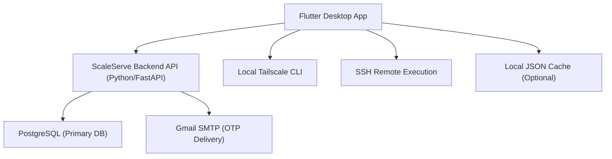

# ScaleServe Manual

This manual documents the current architecture:

- Flutter desktop app for Tailscale + remote runner operations
- Backend API (`scaleserve_backend`) for authentication
- PostgreSQL for auth + runtime data (users, OTP, settings, machine snapshots, run logs)
- Optional local JSON cache files (no local database engine)

## 1. Architecture



## 2. What Lives Where

### Backend PostgreSQL (auth source of truth)

- `workspaces`: tenant/workspace boundaries
- `workspace_users`: user membership and role per workspace
- `workspace_settings`: workspace-scoped settings
- `app_users`: username/email/password hash/role/mfa state/login timestamps
- `auth_otp_challenges`: OTP challenges for MFA + forgot-password
- `app_settings`: key/value application settings
- `machine_inventory`: discovered tailnet machines and last seen status
- `remote_device_profiles`: per-machine SSH execution profiles
- `remote_run_logs`: remote execution run history
- `command_logs`: command-level execution logs
- `auth_events`: login/MFA/reset security events
- `tailscale_snapshot_logs`: raw tailscale snapshot payload history

### Local runtime cache (optional, non-authoritative)

- `scaleserve_runtime/local_settings.json`
- `scaleserve_runtime/remote_compute_state.json`
- `scaleserve_runtime/machine_inventory.json`
- `scaleserve_runtime/command_logs.json`

Runtime writes are synced to backend PostgreSQL. Backend tables are the source of truth.
Rows are scoped by `workspace_id` in backend tables for multi-tenant separation.

## 3. Prerequisites

- Flutter SDK 3.x+
- Python 3.10+
- PostgreSQL 16+ (or Docker Compose)
- Tailscale installed on operator machine
- SSH client installed on operator machine
- Gmail account + Gmail App Password for OTP delivery

## 4. Backend Setup (PostgreSQL + Auth API)

From repository root:

```bash
cd scaleserve_backend
cp .env.example .env
```

Update `.env`:

- `DATABASE_URL`
- `JWT_SECRET`
- `SMTP_GMAIL_USER`
- `SMTP_GMAIL_APP_PASSWORD`

Optional local Postgres via Docker:

```bash
cd scaleserve_backend
docker compose up -d
```

Install and run backend:

```bash
cd scaleserve_backend
python3 -m venv .venv
source .venv/bin/activate
pip install -r requirements.txt
uvicorn src.main:app --host 0.0.0.0 --port 8080
```

Backend defaults to: `http://localhost:8080`

Health check:

```bash
curl http://localhost:8080/health
```

## 5. Flutter App Setup

```bash
cd scaleserve_flutter
flutter pub get
flutter run -d macos
```

Windows:

```bash
cd scaleserve_flutter
flutter pub get
flutter run -d windows
```

## 6. Authentication Flow

### First run bootstrap

1. Open app login page.
2. If no backend users exist, app shows `Create first operator account`.
3. Enter:
   - Gmail (used as login + recovery)
   - password
   - optional `Enable MFA at sign-in`
4. Submit. Backend creates first user (`admin` role) in PostgreSQL.

### Normal login

1. Enter Gmail + password.
2. Backend validates password hash from PostgreSQL.
3. If MFA enabled:
   - backend sends OTP to recovery Gmail
   - app prompts for MFA OTP
4. On success, backend returns JWT + user profile and app opens dashboard.

### Forgot password

1. Click `Forgot password?` on login page.
2. Enter recovery Gmail and send OTP.
3. OTP is emailed from backend Gmail SMTP.
4. Enter OTP + new password.
5. Backend verifies OTP and updates password hash.

## 7. App Usage (Ops Flow)

### A) Join machines to tailnet

Use `Access & Auth -> Join Commands` to copy OS-specific join commands.

### B) Prepare remote SSH access

In `Remote Runner`:

1. Generate SSH keypair.
2. Select device.
3. Install key on remote target.
4. Test SSH access.
5. Save profile.

### C) Execute workload

- Run direct command: `Run On Selected Device`
- Use command presets for shell, GPU checks, Ollama, OpenAI, and local OpenAI-compatible endpoints
- Stream local files/scripts into Python, bash, sh, Node.js, PowerShell, Ruby, Perl, or any custom stdin-reading command
- Optional Python interactive stdin + stop control + Windows cleanup

## 8. Backend API Endpoints

- `GET /health`
- `GET /auth/status`
- `POST /auth/bootstrap`
- `POST /auth/login`
- `POST /auth/login/mfa/request`
- `POST /auth/login/mfa/verify`
- `POST /auth/forgot-password/request`
- `POST /auth/forgot-password/reset`
- `POST /sync/settings`
- `POST /sync/machine-snapshot`
- `POST /sync/command-log`
- `POST /sync/remote-state`

## 9. Database Schemas

### Backend schema

Location:

- `scaleserve_backend/sql/001_init.sql`

Core tables:

- `app_users`
- `workspaces`
- `workspace_users`
- `workspace_settings`
- `auth_otp_challenges`
- `app_settings`
- `machine_inventory`
- `remote_device_profiles`
- `remote_run_logs`
- `command_logs`
- `auth_events`
- `tailscale_snapshot_logs`

### Local cache files

Location:

- `scaleserve_runtime/`

Core files:

- `local_settings.json`
- `remote_compute_state.json`
- `machine_inventory.json`
- `command_logs.json`

## 10. Troubleshooting

### Login says backend unavailable

- Ensure backend is running on `http://localhost:8080`
- Verify `.env` has valid `DATABASE_URL` and `JWT_SECRET`
- Check backend terminal logs

### OTP not delivered

- Verify `SMTP_GMAIL_USER` and `SMTP_GMAIL_APP_PASSWORD`
- Ensure Gmail App Password is active
- Check spam folder
- Check backend logs for SMTP errors

### MFA keeps failing

- OTP expires (default 10 minutes)
- OTP has attempt limits
- Request a new OTP and retry

### Remote runner works but login fails

- Remote runner uses local Tailscale + SSH flow
- Login depends on backend API + PostgreSQL
- Verify both systems separately

## 11. Source Map

### Flutter

- `lib/main.dart`: UI flow, login screens, dashboard logic
- `lib/backend_auth_service.dart`: HTTP auth client to backend
- `lib/tailscale_service.dart`: Tailscale CLI wrapper
- `lib/remote_compute_store.dart`: local JSON cache + runtime sync client

### Backend

- `scaleserve_backend/src/main.py`: auth + OTP API
- `scaleserve_backend/sql/001_init.sql`: PostgreSQL schema
- `scaleserve_backend/.env.example`: configuration template
